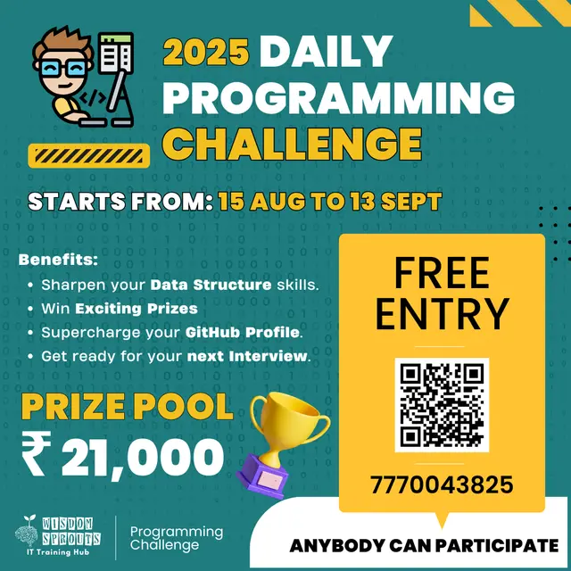

# 30-Day Free Daily Programming Challenge (Wisdom Sprouts)

[](https://dpc.wisdomsprouts.in/_next/image?url=%2Fassests%2Fbanner.png&w=640&q=75)

Welcome to my solutions for the **30-Day Free Daily Programming Challenge** organized by [Wisdom Sprouts IT Training Hub](https://dpc.wisdomsprouts.in/register).

📅 **Challenge Dates:** 15 Aug 2025 → 13 Sep 2025  
🏆 **Prize Pool:** ₹21,000  
💡 **Goal:** Solve 1 coding problem every day for 30 days.

---

## 📌 Challenge Rules
- 1 new coding problem posted daily.
- Problems are based on **DSA, logic building, and real interview questions**.
- Submit solutions daily to maintain a **30-day streak**.
- Final test will decide winners.

---

## ▶️ How to Run
```bash
# Clone the repository
git clone https://github.com/dhruvjagtap07/Daily-Programming-Challenge-2025.git

# Compile and run (example for C++)
g++ Day1.cpp -o Day1
./Day1

```
---

## 📅 Progress Tracker

| Day   | Problem Name    | Status |
| ----- | --------------- | ------ |
| Day 1 | Sort 0s, 1s, 2s | ✅ Done |
| Day 2 | Missing Number  | ✅ Done |
| Day 3 | Duplicate Number| ✅ Done |
| Day 4 | Merge Two Arrays| ✅ Done |
| Day 5 | Array Leaders | ✅ Done |
| Day 6 | Sub Array sum zero | ✅ Done |
| Day 7 | Trapping Rain water | ✅ Done |
| Day 8 | Reverse Words | ✅ Done |
| Day 9 | Longest Prefix | ✅ Done |
| Day 10 | Find Anagrams | ✅ Done |
| Day 11 | String Permutation's | ✅ Done |
| Day 12 | Valid Parentheses | ✅ Done |
| Day 13 | Longest Palindromic Substring | ✅ Done |
| Day 14 | Count Substrings with Exactly K Distinct Characters | ✅ Done |
| Day 15 | Longest Substring | ✅ Done |
| Day 16 | LCM of two numbers | ✅ Done |
| Day 17 | Prime Factorization | ✅ Done |
| Day 18 | Number of Divisors | ✅ Done |
| Day 19 | Evaluate a Postfix Expression | ✅ Done |
| Day 20 | Sort a Stack using recursion | ✅ Done |
| Day 21 | Reverse a Stack using recursion | ✅ Done |
| Day 22 | First Element to Repeat k Times | ✅ Done |
| Day 23 | Sliding Window Maximum | ✅ Done |
| Day 24 | Lowest Common Ancestor in a Binary Tree | ✅ Done |
| Day 25 | Valid Binary Tree | ✅ Done |
| Day 26 | Detect a Cycle in Graph | ✅ Done |
| Day 27 | Coming soon...  | ⏳      |
| ...   | ...             | ...    |

---
## Questions 

### [Day 1](https://docs.google.com/document/d/13A4_Ao-rcPtBixXnsMMDuN4ByQTIwV3dWuxmbxoJryA/edit?tab=t.0):
You are given an array arr consisting only of 0s, 1s, and 2s. The task is to sort the array in increasing order 
in linear time (i.e., O(n)) without using any extra space. This means you need to rearrange the array in-place.
[**solution**](https://github.com/dhruvjagtap07/Daily-Programming-Challenge-2025/blob/main/Day1.cpp)

### [Day 2](https://docs.google.com/document/d/12_bbV-jW2RakUKA1C6yTllF_npjjmnTuyHHVSD5NVj8/edit?tab=t.0):
You are given an array arr containing n-1 distinct integers. The array consists of integers taken from the
range 1 to n, meaning one integer is missing from this sequence. Your task is to find the missing integer.
[**solution**](https://github.com/dhruvjagtap07/Daily-Programming-Challenge-2025/blob/main/Day2.cpp)

### [Day 3](https://docs.google.com/document/d/1EjdgSLCZ8atJKF9HczIIikWPlg2fioRLqdE9lHlxd5M/edit?tab=t.0):
You are given an array arr containing n-1 distinct integers. The array consists of integers taken from the
range 1 to n, meaning one integer is missing from this sequence. Your task is to find the missing integer.
[**solution**](https://github.com/dhruvjagtap07/Daily-Programming-Challenge-2025/blob/main/Day3.cpp)

### [Day 4](https://docs.google.com/document/d/1OgR1qKTZmBkNiqWXfCnpsElLJqQBQKvce7WF1R_XXA4/edit?tab=t.0):
You are given two sorted arrays arr1 of size m and arr2 of size n. Your task is to merge these two arrays into a single sorted array without using any extra space (i.e., in-place merging). The elements in arr1 should be merged first, followed by the elements of arr2, resulting in both arrays being sorted after the merge.
[**solution**](https://github.com/dhruvjagtap07/Daily-Programming-Challenge-2025/blob/main/Day4.cpp)

### [Day 5](https://docs.google.com/document/d/1lKNcZA8OToRCwL2hqaNzYx5A2ImGHRRE6K9MQwxh580/edit?tab=t.0):
You are given an integer array arr of size n. An element is considered a leader if it is greater
 than all the elements to its right. Your task is to find all such leader elements in the array.
[**solution**](https://github.com/dhruvjagtap07/Daily-Programming-Challenge-2025/blob/main/Day5.cpp)

### [Day 6](https://docs.google.com/document/d/1KMZ0FfJQE9px1mO_j6VmFXe7ueBa2-Z-nQ6BrE9G2rI/edit?tab=t.0):
You are given an integer array arr of size n. Your task is to find all the subarrays whose elements sum up to zero. A subarray is defined as a contiguous part of the array, and you must return the starting and ending indices of each subarray.
[**solution**](https://github.com/dhruvjagtap07/Daily-Programming-Challenge-2025/blob/main/Day6.cpp)

### [Day 7](https://docs.google.com/document/d/1VpkYkKC07_1tUL_AsoJYi0s8G8xVP5LcQMuPOtP3yeI/edit?tab=t.0):
You are given an array height[] of non-negative integers where each element represents the height of a bar in a histogram-like structure. These bars are placed next to each other, and the width of each bar is 1 unit. When it rains, water gets trapped between the bars if there are taller bars on both the left and right of the shorter bars. The task is to calculate how much water can be trapped between these bars after the rain.
[**solution**](https://github.com/dhruvjagtap07/Daily-Programming-Challenge-2025/blob/main/Day7.cpp)

### [Day 8](https://docs.google.com/document/d/1Rmsjd6ZHBpNXo2dgcHo-pGPVVsHdJ8nQEDl5HrLPvY4/edit?tab=t.0):
You are given a string s that consists of multiple words separated by spaces. Your task is to reverse the order of the words in the string. Words are defined as sequences of non-space characters. The output string should not contain leading or trailing spaces, and multiple spaces between words should be reduced to a single space.
[**solution**](https://github.com/dhruvjagtap07/Daily-Programming-Challenge-2025/blob/main/Day8.cpp)

### [Day 9](https://docs.google.com/document/d/1ne2Rx3CGsbipkIEHlR0xXWAoyKn69qgyPD7USIbZKjo/edit?tab=t.0):
You are given an array of strings strs[], consisting of lowercase letters. Your task is to find the longest
common prefix shared among all the strings. If there is no common prefix, return an empty string "".A common
prefix is a substring that appears at the beginning of all the strings in the array. The task is to identify
the longest such prefix that all strings share.
[**solution**](https://github.com/dhruvjagtap07/Daily-Programming-Challenge-2025/blob/main/Day9.cpp)

### [Day 10](https://docs.google.com/document/d/1vLsga5LSrkePvcIcAjVIXNzxm8-ohXGyTslLarPd_m0/edit?tab=t.0):
You are given an array of strings strs[]. Your task is to group all the strings that are anagrams of each other. An anagram is a word or phrase formed by rearranging the letters of a different word or phrase, typically using all the original letters exactly once. The goal is to return the grouped anagrams as a list of lists, where each sublist contains words that are anagrams of each other.
[**solution**](https://github.com/dhruvjagtap07/Daily-Programming-Challenge-2025/blob/main/Day10.cpp)

### [Day 11](https://docs.google.com/document/d/1UG8x6IpG-7NM6beEtZyx4VYfWfrX3dEm1zG1t2cS5qo/edit?tab=t.0):
You are given a string s. Your task is to generate and return all possible permutations of the characters in 
the string. A permutation is a rearrangement of the characters in the string, and each character must appear 
exactly once in every permutation. If there are duplicate characters in the string, the resulting permutations
should also be unique (i.e., no repeated permutations).
[**solution**](https://github.com/dhruvjagtap07/Daily-Programming-Challenge-2025/blob/main/Day11.cpp)

### [Day 12](https://docs.google.com/document/d/1NUePZz68oMD3Jyi8TT3qDIYazRL_t4jkfuw95H-T_Qs/edit?tab=t.0):
You are given a string s consisting of different types of parentheses: (), {}, and []. Your task is
to determine whether the given string is valid. A string is considered valid if:
1. Every opening bracket has a corresponding closing bracket of the same type.
2. The brackets are closed in the correct order. This means that a closing
   bracket must close the most recent unmatched opening bracket.
[**solution**](https://github.com/dhruvjagtap07/Daily-Programming-Challenge-2025/blob/main/Day12.cpp)

### [Day 13](https://docs.google.com/document/d/1dhSQWn4VskminZMcgmnmHqn1u3a5HlXD3aIBkKS3vKU/edit?tab=t.0):
You are given a string s. Your task is to find and return the longest palindromic substring 
within the given string. A palindrome is a string that reads the same forwards and backwards.
[**solution**](https://github.com/dhruvjagtap07/Daily-Programming-Challenge-2025/blob/main/Day13.cpp)

### [Day 14](https://docs.google.com/document/d/1s1II27KnOrgFJFqoVmrhex7E_BGSV-d2P0_iYBqu71o/edit?tab=t.0):
You are given a string s of lowercase English alphabets and an integer k. Your task 
is to count all possible substrings of s that contain exactly k distinct characters.
[**solution**](https://github.com/dhruvjagtap07/Daily-Programming-Challenge-2025/blob/main/Day14.cpp)

### [Day 15](https://docs.google.com/document/d/1O-I-LwpUhdnxF8vtEAkIAOyCqH5uFZJtCBuqL39krTs/edit?tab=t.0):
You are given a string S, and your task is to find the length of the longest substring that 
contains no repeating characters. A substring is a contiguous block of characters in the string.
[**solution**](https://github.com/dhruvjagtap07/Daily-Programming-Challenge-2025/blob/main/Day15.cpp)

### [Day 16](https://docs.google.com/document/d/1IYVT5Ji2TdxEHTt8s0VBrMh2p2tbuD7XhVaiJNEhEwc/edit?tab=t.0):
You are given two integers, N and M. Your task is to find the Least Common Multiple (LCM) of these 
two numbers. The LCM of two integers is the smallest positive integer that is divisible by both N and M.
[**solution**](https://github.com/dhruvjagtap07/Daily-Programming-Challenge-2025/blob/main/Day16.cpp)

### [Day 17](https://docs.google.com/document/d/1z-zPYWaywuymkyIDdTRRq2bH8TXJJVW896pJXlKl0a8/edit?tab=t.0):
Given a positive integer N, your task is to find its prime factorization. Return a list of prime 
numbers that multiply together to give N. If N is prime, the output should be a list containing only N.
[**solution**](https://github.com/dhruvjagtap07/Daily-Programming-Challenge-2025/blob/main/Day17.cpp)

### [Day 18](https://docs.google.com/document/d/1LbNORWiQSVY1C5TbS7ucoGFR1d0ttg7vWMDF2sxC3HI/edit?tab=t.0):
Given a positive integer N, your task is to find the total number of divisors (factors) of N. 
A divisor of N is any integer that divides N without leaving a remainder. A divisor of a number 
is any integer that divides the number evenly (i.e., without a remainder). 
[**solution**](https://github.com/dhruvjagtap07/Daily-Programming-Challenge-2025/blob/main/Day18.cpp)

### [Day 19](https://docs.google.com/document/d/1E-FOtZ_p1dtsvvdYJUhzhQ_4Q5tIL_qMj27MHo0qjkw/edit?tab=t.0):
Given a postfix expression (also known as Reverse Polish Notation), your task is to evaluate the expression and return the result. The expression can contain integers and the four basic arithmetic operators +, -, *, and /. Assume that the input is always valid and the division operator performs integer division, truncating towards zero.
[**solution**](https://github.com/dhruvjagtap07/Daily-Programming-Challenge-2025/blob/main/Day19.cpp)

### [Day 20](https://docs.google.com/document/d/13megzpeSisgjpkGST7jm9HIuf_pxljiHdMdAxJzwioc/edit?tab=t.0):
Given a stack of integers, your task is to write a function that sorts the stack in ascending order. 
You are not allowed to use any additional data structure like arrays, lists, or another stack. The 
only operations you are allowed to perform are push, pop, and peek on the stack. The sorting must 
be performed using recursion only.
[**solution**](https://github.com/dhruvjagtap07/Daily-Programming-Challenge-2025/blob/main/Day20.cpp)

### [Day 21](https://docs.google.com/document/d/1_Hk6mo8O-9iOs_zqeaQPGGYYpvpGf4G1dQVX6cph0o0/edit?tab=t.0):
You are given a stack of integers, and your task is to write a function that reverses the stack using recursion.
You are not allowed to use any additional data structure (like arrays, lists, or another stack). The only
operations you are allowed to perform are push, pop, and peek on the stack. The reversal must be done using
recursion only.
[**solution**](https://github.com/dhruvjagtap07/Daily-Programming-Challenge-2025/blob/main/Day21.cpp)

### [Day 22](https://docs.google.com/document/d/1avnRg6bMiSi0HaDfIX5O1N4CXOe3Lm5Wi3RofJ-5F1M/edit?tab=t.0):
You are given an array of integers and an integer k. Your task is to find the first element 
in the array that appears exactly k times. If no such element exists, return -1.
[**solution**](https://github.com/dhruvjagtap07/Daily-Programming-Challenge-2025/blob/main/Day22.cpp)

### [Day 23](https://docs.google.com/document/d/18Lk3c6lbZGdK0xnUUyB2kg_m_wAvqA3gOHyEFXiVrOg/edit?tab=t.0):
You are given an array of integers arr and a positive integer k. Your task is to find the maximum 
element in each sliding window of size k. The window slides from left to right, one element at a 
time, and you need to return the maximum element for each of these windows.
[**solution**](https://github.com/dhruvjagtap07/Daily-Programming-Challenge-2025/blob/main/Day23.cpp)

### [Day 24](https://docs.google.com/document/d/1f8XIUlP-HA-Ncb8sybVjukDcMvf9J827WcEWHsv1joU/edit?tab=t.0):
You are given a binary tree and two distinct nodes within the tree. Your task is to find the lowest 
common ancestor (LCA) of these two nodes. The LCA of two nodes p and q is defined as the lowest node 
in the tree that has both p and q as descendants (where we allow a node to be a descendant of itself).
[**solution**](https://github.com/dhruvjagtap07/Daily-Programming-Challenge-2025/blob/main/Day24.cpp)

### [Day 25](https://docs.google.com/document/d/1I0JMR6siS0a9AUE-JoAgIV4aiAacNvBm2lFnInfq-eQ/edit?tab=t.0):
You are given the root of a binary tree. Your task is to determine whether the tree is a valid Binary Search Tree (BST). A binary search tree is defined as a tree where:
- Every node’s left subtree contains only nodes with values less than the node’s value.
- Every node’s right subtree contains only nodes with values greater than the node’s value.
- Both the left and right subtrees must also be binary search trees.
[**solution**](https://github.com/dhruvjagtap07/Daily-Programming-Challenge-2025/blob/main/Day25.cpp)

### [Day 26](https://docs.google.com/document/d/1I0JMR6siS0a9AUE-JoAgIV4aiAacNvBm2lFnInfq-eQ/edit?tab=t.0):
You are given an undirected graph represented by an adjacency list. Your task is to determine if the graph
contains any cycle. A cycle is formed if you can traverse through a sequence of edges that starts and ends
at the same vertex, with at least one edge in between.
[**solution**](https://github.com/dhruvjagtap07/Daily-Programming-Challenge-2025/blob/main/Day26.cpp)

---

## 🔗 Official Links

- [Register Here](https://dpc.wisdomsprouts.in/register?ref=DJ7AW)
- [More Info](https://docs.google.com/document/d/1hFLlAvbqOOVp4IBrP8SWOsDyHlkTjS7HBR79Ot6ekS4/edit?tab=t.0)
- [WhatsApp Group](https://chat.whatsapp.com/KpIwV0j91kY1S0knpJnhp2)

